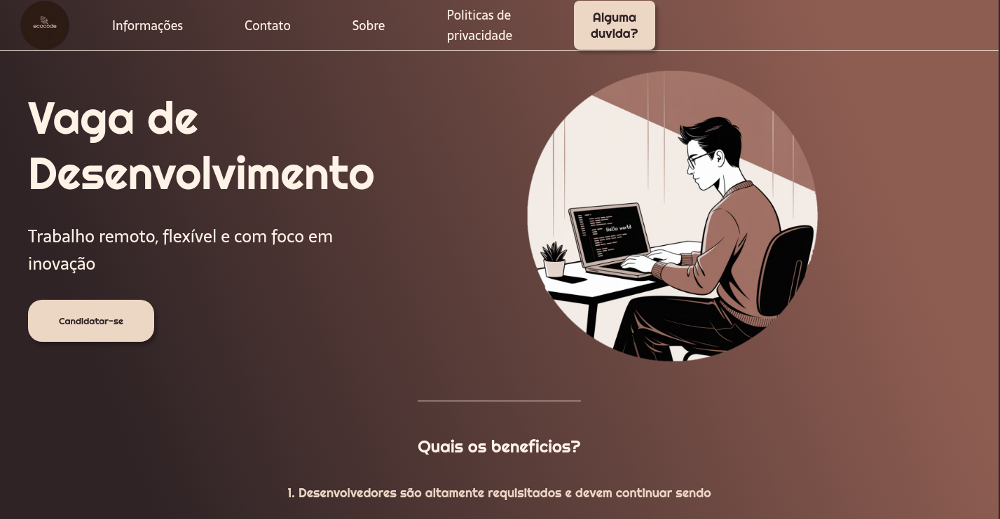

# 💼 Candidatura para Vaga de Desenvolvedor(a)

Este projeto é uma landing page moderna e responsiva desenvolvida com **HTML5** e **CSS3**. O objetivo é apresentar uma vaga de desenvolvimento, destacando seus benefícios e incentivando candidatos(as) a se inscreverem.

## 🖼️ Prévia

 

---

## 🚀 Funcionalidades

- Layout responsivo e estilizado com gradiente de fundo.
- Cabeçalho com navegação intuitiva.
- Destaque para informações da vaga com chamada para ação.
- Seção de benefícios para o(a) candidato(a).
- Rodapé institucional.
- Botões estilizados com sombras e bordas arredondadas.
- Imagens com formato oval para destaque visual.

---

## 🛠️ Tecnologias Utilizadas

- HTML5  
- CSS3  
- Google Fonts (`Righteous`, `Sarala`)

---

## 🎨 Estilo e Responsividade

- Design moderno com foco em usabilidade e clareza.
- Tipografia personalizada para títulos e textos.
- Estilização de botões e elementos visuais com sombras e bordas arredondadas.

---

## 📂 Estrutura de Arquivos

📁 candidatura-desenvolvedor
├── 📄 index.html
├── 📄 style.css
├── 🖼️ logo.png
├── 🖼️ logo2.png
└── 🖼️ preview.png (opcional)


---

## 📋 Como Usar

1. Clone o repositório ou baixe os arquivos ZIP:
   ```bash
   git clone https://github.com/seu-usuario/seu-repositorio.git
   cd candidatura-desenvolvedor
    
